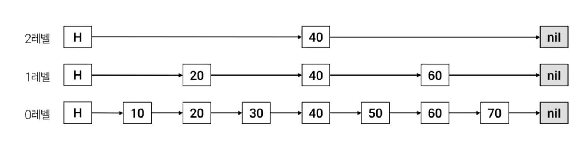
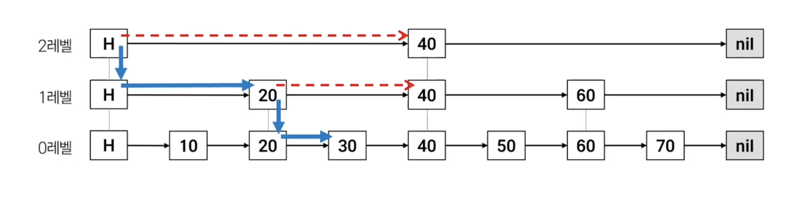
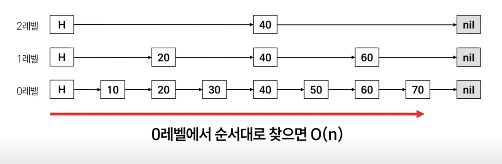
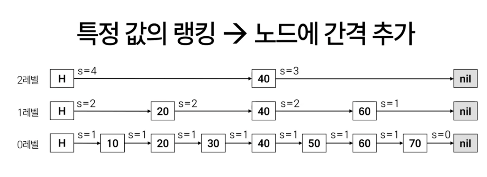
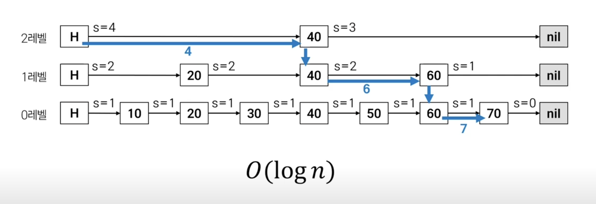
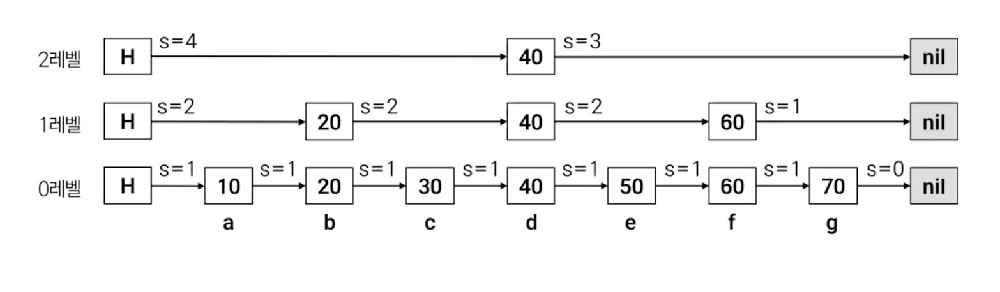

### ✅ Sorted Set

- 순위표/랭킹 구현에 사용
- 특정인의 순위 알 수 있음

### ✅ Skip List

Sorted Set 구현에 사용한 자료 구조는 Skip List



- 연결 리스트가 계층을 구성함 → 0, 1, 2 레벨
- 각 연결 리스트는 값을 순서대로 가짐
- 0 레벨: 전체 값을 가짐
- 상위 레벨: 하위 노드에서 일부 노드만 포함

**검색 - 30 찾기**
- 만약 0레벨처럼 단일 연결 리스트 구조라면 앞에서부터 순차적으로 검색할 것이다.



- 계층 구조를 가지고 있는 Skip List는 가장 최상위 레벨에서부터 시작한다.

```tsx
- 2레벨 HEAD 노드에서 다음노드 확인 → 40, 30보다 크군 더이상 진행 X, 한 칸 내려감

- 1레벨 HEAD 노드에서 다음노드 확인 → 20, 30보다 작군, 다음노드 확인 → 40, 30보다 크군 더이상 진행 X, 한 칸 내려감

- 0레벨 20노드에서 다음노드 확인 → 30이 있네!
```

- 삽입과 삭제도 비슷한 방식으로 자리를 찾아간다.
- 평균 O(log n)의 시간복잡도를 가진다.

**값 70의 랭킹은?**



- 그냥 0레벨에서 순서대로 찾으면 O(n)
- Skip List에서는 랭킹을 찾기 위해서 새로운 정보를 하나 추가한다.



- **각 노드간의 간격(칸)을 추가한다. → SPAN**



- 동일하게 최상위 레벨부터 시작한다.
- 이런식으로 O(log n)의 시간복잡도로 랭킹을 구할 수 있다.

**키 c의 랭킹은?**



- 해시테이블로 (키, 값) 쌍을 유지
- 먼저 c에 해당하는 값을 구하고, 랭킹을 찾아간다.

### ✅ **정리**

**Redis Sorted Set = Skip List + Hashtable**

- 랭킹을 구하기 위해 내부적으로 부가정보인 SPAN 값을 관리한다.
- 단점 → 계층 구조에 따른 메모리 사용량 증가

### ✅ **궁금한 점**
Q. Sorted Set을 활용해 순위를 매길 때, 복합적인 정렬 조건이 필요한 경우 일반적으로 어떤 접근을 많이 할까?
예를 들어 게임 등수처럼 킬, 데스, 어시스트 각각에 가중치를 두고 점수를 계산해야 한다면
다음과 같은 방법이 있을 것 같은데 일반적으로는 어떤 방식을 더 유용하게 쓸지 궁금했다.

    1. 하나의 ZSET만 사용하고, 애플리케이션 로직에서 가중치를 적용해 단일 점수로 계산해서 저장한다.,
    2. ZSET:kills, ZSET:assists, ZSET:deaths를 따로 관리한 뒤, ZUNIONSTORE로 가중치를 조합한 랭킹을 주기적으로 계산해서 캐싱한다.,

- 1번은 이미 연산이 다 된 단일값이라 퍼포먼스는 좋음. 
- 하지만 각각의 요소로 다시 분해해서 파악하기 어렵고, 만약 가중치 변경되면 대시보드나 랭킹표 등의 전체가 한꺼번에 바뀌어야함.

- 2번은 각 지표별로 통계 보기가 편하고, 가중치가 변경되어도 계산만 다시하면 되기때문에 원본데이터 손실이 없거나 적음. 
- 1번이 완전 실시간, 2번이 배치로 갱신해도 되는 경우에 사용한다고 생각하면 될 것 같음.
- 상황에 쓰면 되고 1번 방법 + 원본데이터 유지하는 케이스도 있었고 구현하기 나름으로 때에 따라 적절히 활용하면 됨
- 정리하자면 1번 방식을 사용하고 원본 데이터를 DB에 둔다-> 2번이랑 비슷한 접근
- 그럼 2번 방식에서 ZSET을 여러 개 굳이 쓰는지 -> 실제환경에서 데이터베이스를 사용하지 않거나, 데이터가 레디스에서만 발생할 수 있음, 또 측정했을때 ZUNIONSTORE로 통계내는게 더 빠를 수 있음(어차피 레디스 내부라면)

[🔗 출처 링크](https://www.youtube.com/watch?v=-titFXvd5xE)