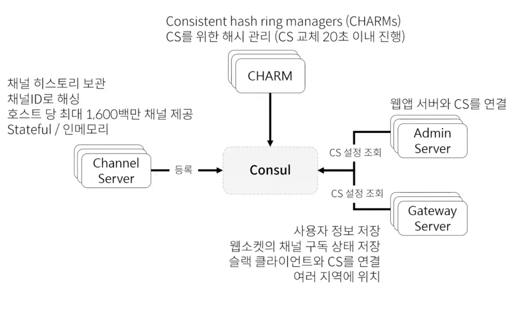
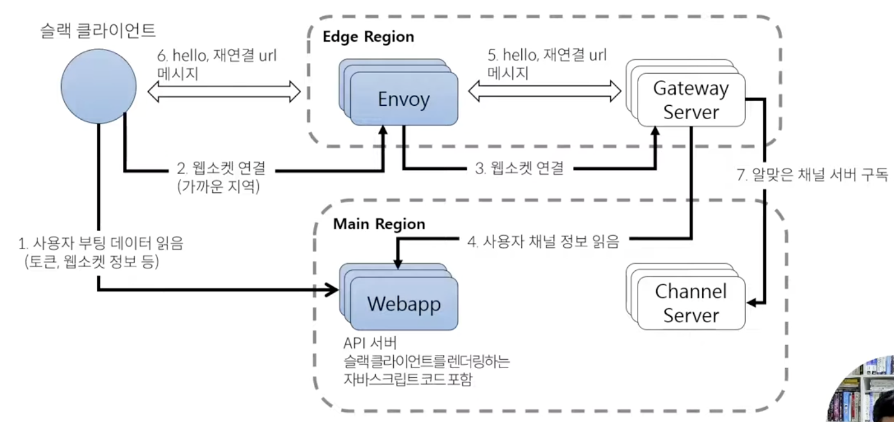
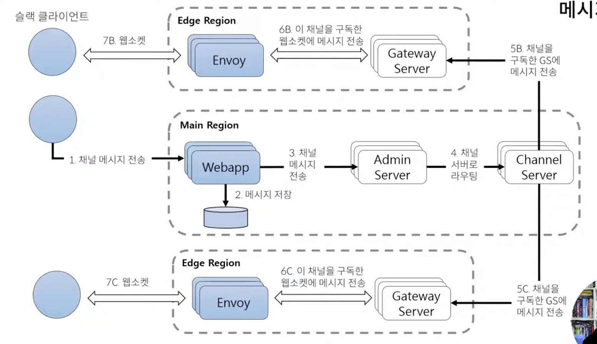
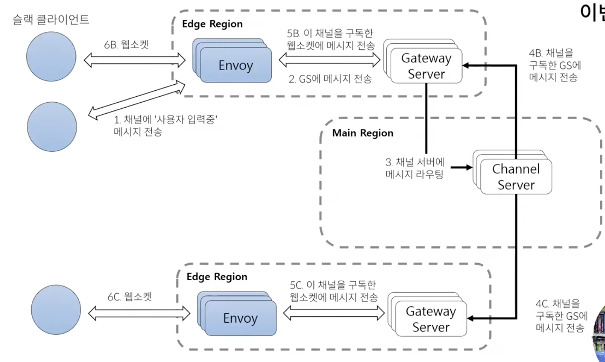

### ✅ 구조 개요

Channel Server
- 슬랙에 있는 채널과 관련된 서버
- 각 채널에 대한 정보 보관
- 특정 채널이 어떤 채널 서버로 할당이 되는지에 대한 정보 → 안정 해시 기법을 이용하여 해싱 처리하여 지정함
- 하나의 호스트 당 최대 1600백만 채널 제공
- 해시는 누가 관리? → 채널과 그 채널에 따른 안정 해시를 관리하는 서버가 따로 있는데 그게 바로 CHARM Server

CHARM Server
- Consistent hash ring managers
- CS(Channel Server)를 위한 해시 값 관리
- 하나의 CS가 불안정할 때 그를 대체하는 CS를 하나 만드는데, 약 20초 이내에 교체가 진행됨

Admin Server
- 웹앱 서버와 CS를 중간에 연결해주는 역할

Gateway Server
- 슬랙 클라이언트와 실제 연결되게 되는 서버
→ 슬랙 클라이언트가 GS에 붙으면 그 GS 서버는 다시 여러개의 CS를 구독하는 형태로 동작
- 사용자 정보 저장 
- 웹소켓의 채널 구독 상태 저장 
- GS는 여러 지역 리전에 분산되어 위치함
 → 따라서 슬랙 클라이언트가 가장 가까운 리전의 GS에 연결됨

### ✅ 클라이언트 연결

1. 슬랙 클라이언트가 가장 먼저 하는 것은 웹앱 서버에 연결하여 사용자 정보를 읽어온다.
    - 이 웹앱 서버가 일종의 API 서버 역할
    - 웹앱 서버는 슬랙 클라이언트가 렌더링하는데 필요한 JS 파일 등의 코드도 포함하고 있다.
2. 가까운 지역 Edge Region 내 Envoy 서버에 웹소켓 연결 한다.
3. 그 Envoy 서버는 다시 Gateway 서버에 붙게 된다.
4. Gateway 서버는 사용자 정보를 읽어오기 위해 웹앱 서버를 호출하여 그 사용자에 해당하는 채널 목록들을 읽어온다.
5. Gateway 서버는 다시 Envoy 서버에 정보를 주고, Hello 재연결 확인한다.
6. 다시 Envoy 서버는 슬랙 클라이언트에 그 정보를 전달한다.
7. 그리고 나서 알맞은 채널 서버를 구독한다. 채널마다 채널 서버가 할당이 되기 때문에 **Gateway 서버는 여러 채널 서버를 구독**한다.
8. 이렇게하면 클라이언트가 메시지를 주고 받을 수 있는 상태가 된 것이다.

### ✅ 메시지 전송

1. 슬랙 클라이언트가 메시지를 전송한다. → 웹앱 서버가 제공하는 API 이용
2. 웹앱 서버는 메시지를 저장한다.
3. 웹앱 서버는 어드민 서버에 채널 메시지 전송 요청을 한다.
4. 어드민 서버가 알맞은 채널 서버를 찾아서 메시징을 라우팅한다.
5. 채널 서버는 자신을 구독하고 있던 게이트웨이 서버한테 메시지가 왔다고 전송을 한다. (그림의 경우 5B, 5C 두 게이트웨이 서버에 전송)
6. 게이트웨이 서버는 다시 엔보이 서버한테 전달을 한다.
7. 엔보이 서버는 최종적으로 슬랙 클라이언트한테 메시지를 전송한다.

### ✅ 이벤트 전송

실제 슬랙에는 슬랙 메시지를 주고받는 것뿐만 아니라 이벤트라고 설명된 이벤트 종류도 있다. 약간의 휘발성 메시지 혹은 정해진 주기로 실행되는 것에 따라 생기는 메시지를 이벤트라고 슬랙 블로그에서는 정리하고 있다.

- 슬랙에서 **님이 메시지 입력 중과 같이 입력중 상태 보이는 것
- **님이 ##채널에 참여했습니다 등의 메시지

이벤트는 웹앱을 호출하지 않는다. → 저장하지 않는 것!

1. 엔보이 서버에 바로 메시지 전송
2. 게이트웨이 서버한테 해당 메시지 전송
3. 게이트웨이 서버는 채널 서버에 메시지 라우팅 → 이 메시지 보내줘~
4. 채널 서버가 구독된 게이트웨이 서버에게 메시지 전송
5. 게이트웨이 서버는 엔보이서버에 메시지 전송
6. 엔보이가 최종적으로 슬랙 클라이언트에게 전달

### ✅ 정리

이런 구조를 통해서

- 하나의 호스트 당 약 천만 채널을 처리중
- 수 천만의 연결된 클라이언트 처리중
- 500ms 내에 전 세계로 메시지 전송 가능
- 선형적으로 확장 가능한 아키텍처 → 채널 서버를 수평 확장

### ✅ 궁금한 점
#### Q. 웹앱 서버와 게이트웨이 서버 사이에 어드민 서버가 왜 필요하고 어떤 역할을 하는 걸까?
- 어드민 서버의 핵심 역할은 **채널 라우팅 정보를 관리하고 결정하는 역할**을 한다. 

- 사용자가 채널에 어떤 메시지를 보냈냐에 따라 **채널이 어떤 채널 서버에 할당되어 있는지를 결정**해야 하는데, 
    **채널 서버는 동적으로 Consul/CHARM을 통해 배정**되기 때문에,
    결국 **어드민 서버는 Consul을 조회해서 적절한 채널 서버로 라우팅하는 역할**을 한다.

- 역할을 굳이 꼽자면 채널 서버에게 명령 전달도 할 수 있고, 
  웹앱에게 처음으로 메시지를 받아서 어느 클라이언트로 보낼지 결정하는 브로커 역할도 할 수 있으며, 
  채널 서버가 어떤 게이트웨이 서버에 연결되어 있는지도 Consul을 통해서 관리할 수도 있다.

- 채널이 수천만개이고, 어떤 채널이 어떤 채널 서버에 할당되었는지는 고정적이지 않다 -> 이때 동적라우팅을 위해서 어드민 서버가 필요한 것!

**장점**
- 채널 서버 구조가 변경되거나 교체되어도 중간 레이어에서 관리
- 웹앱 서버는 API, 인증 등에 집중하고 어드민 서버는 채널 매핑에만 집중하도록하여 관심사 분리
- 채널 서버는 어드민 서버를 통해서만 통신하기 때문에 보안 향상

#### Q. 채널서버가 죽는(불안정한) 경우에 그를 대체하는 채널 서버를 만든다고 했는데 이경우 보통 불안정했던 서버가 살아나면 원래 서버로 갈아끼우고 새로 만들어져 교체되었던 서버는 삭제되는 방식으로 동작할까?
- 채널서버 A가 죽으면 Consul 등에서 감지하여 해당 채널 ID 해시를 다른 채널서버 B로 배정
- 추후 A가 살아나면 Consul 에서 감지후 A가 맡았던 채널들을 다시 되돌림
- 이때 B는 없애거나 다른 채널 담당하도록 변경
- 또는 B에게 영구적으로 채널을 맡기고, A가 살아나도 다른채널을 할당받거나 무시되는 등의 모델도 있음

[🔗 출처 링크](https://www.youtube.com/watch?v=36F35JZXFKo)