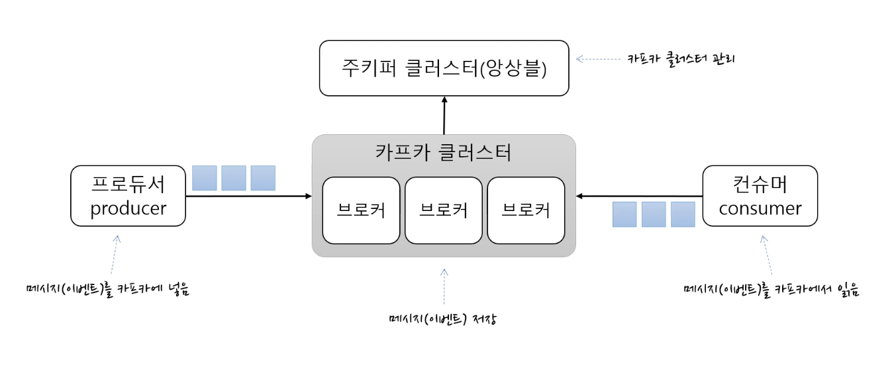
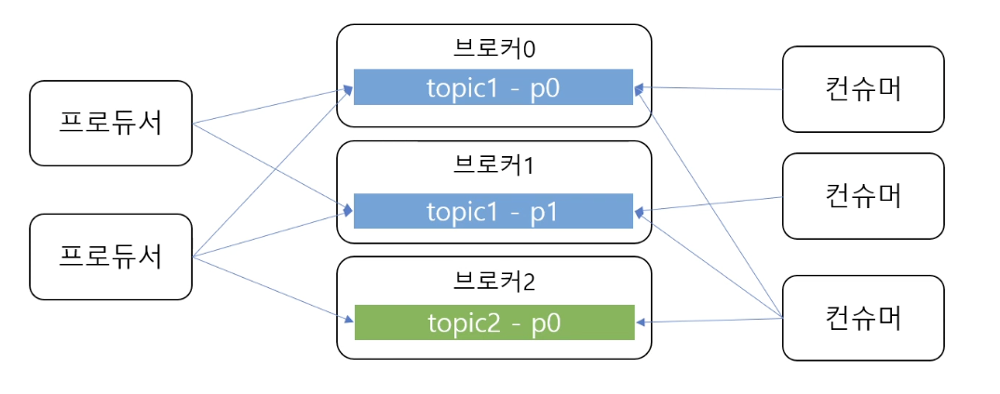
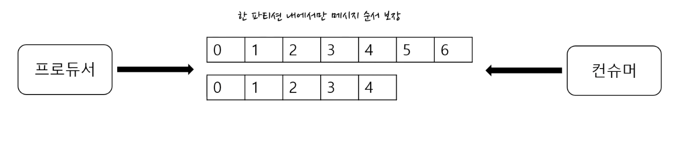
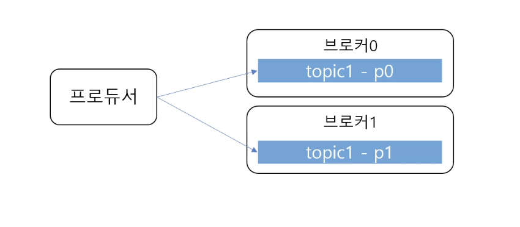
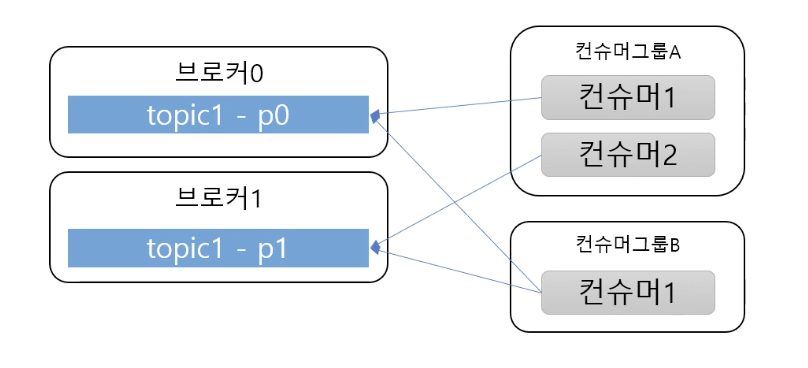
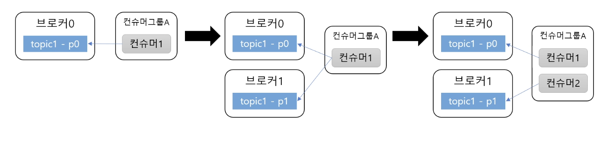
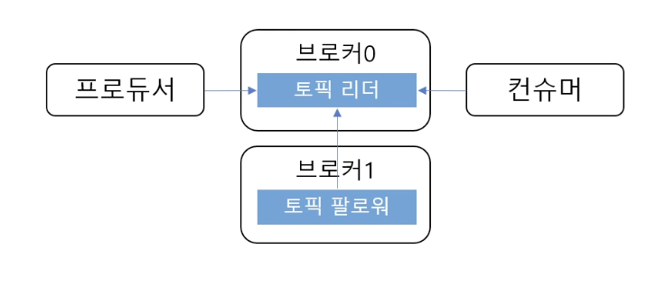

### ✅ 카프카란?

**분산 이벤트 스트리밍 플랫폼**

- 이벤트 스트리밍을 처리하기 위한
- 고성능 플랫폼
- 많은 기업들이 사용 중

### ✅ 기본 구조: 4개의 구성요소

**카프카 클러스터**

- 메시지(이벤트) 저장소
- 여러 개의 브로커로 구성됨 → 브로커를 각각의 서버라고 보면 됨
- 브로커들이 메시지를 나눠서 저장, 이중화 처리, 장애 대체 등의 역할을 함

**주키퍼 클러스터(앙상블)**

- 카프카 클러스터 관리
- 카프카 클러스터에 대한 정보 기록 및 관리

**프로듀서(Producer)**

- 카프카 클러스터에 메시지를 보내는 것
- 메시지(이벤트)를 카프카에 넣는 역할

**컨슈머(consumer)**

- 메시지(이벤트)를 카프카에서 읽어오는 역할

즉 프로듀서가 카프카 클러스터에 메시지를 넣고, 컨슈머는 그 메시지를 읽어와서 필요한 처리를 한다.

따라서 카프카 클러스터는 데이터를 이동하는데 필요한 핵심 역할을 맡게 된다.

### ✅ 토픽과 파티션

**토픽: 메시지를 구분하는 단위**

- 뉴스용 토픽, 주문용 토픽 등
- 각각의 메시지를 알맞게 구분하기 위한 용도
- 파일시스템의 폴더와 유사
- 한 개의 토픽은 한 개 이상의 파티션으로 구성

> 프로듀서는 메시지를 카프카에 저장할 때, 어떤 토픽에 저장해줘라고 요청 -> 
> 컨슈머는 어떤 토픽에서 메시지를 읽어올래라고 함
> 
> 이렇게 프로듀서와 컨슈머가 토픽을 기준으로 메시지를 주고받게 됨

**파티션: 메시지를 저장하는 물리적인 파일**

- 추가만 가능한 append-only 파일 → 카프카가 일부를 삭제, 출력하긴 하지만 기본적으로
- 각 메시지 저장 위치를 **오프셋(offset)**이라고 함
- 프로듀서가 넣은 메시지는 파티션의 맨 뒤에 추가
- 컨슈머는 오프셋 기준으로 메시지를 **순서대로** 읽음
- 메시지는 삭제되지 않음(설정에 따라 일정 시간이 지난 뒤 삭제)

### ✅ 여러 파티션과 프로듀서

**토픽이 여러 파티션으로 구성될 수 있다고 했음 → 그럼 프로듀서는 어떤 파티션에 메시지를 저장?**

- 라운드로빈으로 돌아가면서 저장을 하거나 키를 이용해 파티션 선택
- 프로듀서가 카프카에 메시지를 전송할 때, 토픽의 이름뿐만아니라 키도 지정 가능

  → 같은 해시값을 이용해서 저장할 토픽 선택

- 즉, 같은 키를 갖는 메시지는  같은 파티션에 저장 → 같은 키는 순서 유지

### ✅ 여러 파티션과 컨슈머

- 컨슈머는 컨슈머그룹에 속함
- 한 개 파티션은 컨슈머그룹의 한 개 컨슈머만 연결 가능
- 즉, 컨슈머그룹에 속한 컨슈머들은 한 파티션을 공유할 수 없음

  → 한 컨슈머그룹 기준으로 파티션의 메시지는 순서대로 처리 가능

### ✅ 성능

**파티션 파일은 OS 페이지캐시 사용**

- 파티션에 대한 파일 IO를 메모리에서 처리
- 서버에서 페이지캐시를 카프카만 사용해서 성능에 유리

**Zero Copy**

- 디스크 버퍼에서 네트워크 버퍼로 직접 데이터 복사 → 속도가 빨라짐

**컨슈머 추적을 위해 브로커가 하는 일이 비교적 단순**

- 메시지 필터, 메시지 재전송과 같은 일은 브로커가 하지 않음 → 프로듀서, 컨슈머가 직접 해야함
- 브로커는 컨슈머와 파티션 간 매핑 관리

**묶어서 보내기, 묶어서 받기 (batch)**

- 프로듀서: 일정 크기만큼 메시지를 모아서 전송 가능
- 컨슈머: 최소 크기(일정 크기 이상)만큼 메시지를 모아서 조회 가능

→ 낱개 처리보다 처리량 증가

**처리량 증대(확장)가 쉬움**

- 1개 장비의 용량 한계 → 브로커 추가, 파티션 추가
- 컨슈머가 느림 → 컨슈머 추가 (+파티션 추가)
- 수평 확장이 용이한 구조

### ✅ 리플리카 - 복제

카프카는 장애가 낫을 때 대처하기 위해 리플리카라는 것을 사용함

**리플리카: 파티션의 복제본**

- 복제수(replication factor) 만큼 파티션의 복제본이 각 브로커에 생김

**리더와 팔로워로 구성**

- 여러개의 리플리카 중 하나가 리더가 되고 나머지는 팔로워가됨
- 프로듀서와 컨슈머는 리더를 통해서만 메시지 처리
- 팔로워는 리더로부터 복제(데이터를 읽어와서 저장)

**장애 대응**

- 리더가 속한 브로커 장애 시 다른 팔로워가 리더가 됨

### ✅ 정리

**성능(높은 처리량)**

- OS 페이지캐시
- (다른 메시징 시스템 대비) 단순한 브로커
- 묶어서 데이터 전송
- 파티션/컨슈머 추가로 수평 확장

**고가용성**

- 파티션 리플리케이션 + 리더/팔로워 구조

### ✅ 찾아 보기

- Zero copy
- OS 페이지캐시

### ✅ 궁금한 점
**Q. 만약 카프카 클러스터를 관리하는 주키퍼 클러스터가 불안정하거나 죽는다면 카프카도 완전히 사용 불가한걸까? 이미 연결되어있던 컨슈머와 프로듀서도 중단되어 장애가 발생할까?(주키퍼도 클러스터 형태이지 이런 케이스가 거의 없겠지만)**

- 주키퍼는 메타데이터나 클러스터 자체를 조정하는 coordinator 역할이 있음
  - Coordinator - 조정자, 클러스터를 관리해주는 애
- 주키퍼가 죽어도 기존 프로듀서가 메시지 발행하거나 컨슈머가 메시지 소비하는데는 문제가 없음
- 프로듀서나 컨슈머 자체는 카프카 클러스터(브로커쪽)에 연결되어있으니 문제가 없는 형태
- 하지만 주키퍼가 수행하는 역할에 대해서는 당연히 장애 날 수 있음
  - 예를 들어 리더 재선출을 못한다던지, 토픽생성 / 삭제를 못한다던지, 카프카 재시작을 못한다던지 등
- 메시지 손실 가능성은 ack 설정이나 클러스터 노드 수에 따라 다르지만 거의 없는 정도로 최소화시킬 수 있음
- 카프카: 토픽 생성 → 주키퍼에 명령, 주키퍼가 명령 내려서 브로커 생성하거나 파티션을 나눈다거나
- 최신 카프카에서 주키퍼가 사라짐
- 주키퍼가 브로커 상태검사를 함 서로, 그 때 장애 시 리더 바꾸는데
- 카프카 클러스터가 죽었을 때 pm2 처럼 주키퍼가 재가동 시켜주는데 그것도 불가

**주키퍼(ZooKeeper)는 과거 카프카 클러스터의 핵심적인 조정자(Coordinator) 역할을 담당**

- 메타데이터 관리 → 토픽(Topic) 정보, 파티션(Partition) 정보, 브로커(Broker) 목록 등 클러스터의 모든 중요한 메타데이터를 저장하고 관리
- 클러스터 조정 → 브로커의 등록 및 해제, 컨트롤러(Controller) 브로커 선정, 리더(Leader) 파티션의 선출 및 변경 등 클러스터의 전반적인 상태를 조정
- 상태 감지 → 각 브로커의 상태를 감지하여 장애 발생 시 적절한 조치를 취함

**주키퍼 장애 시 영향**

- 기존 프로듀서/컨슈머 동작 → 이미 연결되어 메시지를 주고받고 있는 프로듀서나 컨슈머는 당장 메시지 발행/소비가 중단되지 않을 수 있음, 이들은 브로커에 직접 연결되어 있기 때문
- 클러스터 관리 기능 마비 → 하지만 클러스터의 중요한 관리 기능들 마비
  - 리더 재선출 불가

    → 브로커 장애가 발생했을 때 파티션의 새로운 리더를 선출할 수 없어 해당 파티션의 메시지 처리가 중단될 수 있음

  - 토픽/파티션 변경 불가

    → 새로운 토픽 생성, 기존 토픽 삭제, 파티션 추가 또는 재조정 등 토픽 관련 작업이 불가능

  - 브로커의 클러스터 참여/이탈 불가

    → 새로운 브로커가 클러스터에 참여하거나, 기존 브로커가 정상적으로 클러스터에서 이탈하는 과정에 문제가 발생

  - 카프카 클러스터 재시작 불가
    → 클러스터 전체를 재시작하거나 설정 변경 후 재로드하는 등의 운영 작업이 어려워짐

**최신 카프카에서의 변화 (KRaft)**

- 최신 카프카 버전에서는 주키퍼 의존성을 제거하고 자체적인 메타데이터 관리 계층인 **KRaft(Kafka Raft)** 모드를 도입
- Kafka 2.8.0 버전에서 주키퍼 없이 카프카를 구동할 수 있도록 추가
- Production 레벨은 Kafka 3.3.0부터 동작 → 레인포는 현재 3.5.1이지만 주키퍼 사용임!
- 주키퍼가 담당했던 역할을 카프카 자체의 Quorum Controller가 수행하도록 하여, 외부 의존성을 줄이고 운영 복잡성을 낮추며 확장성을 개선하는 목표를 가지고 있음
- 따라서 KRaft 모드를 사용하는 카프카 클러스터에서는 주키퍼 장애로부터 자유로움
- 하지만 아직 주키퍼 기반의 카프카 클러스터가 많이 운영되고 있으므로, 주키퍼의 역할과 중요성을 알고 있어야함

[🔗 출처 링크](https://www.youtube.com/watch?v=0Ssx7jJJADI&t=33s)
