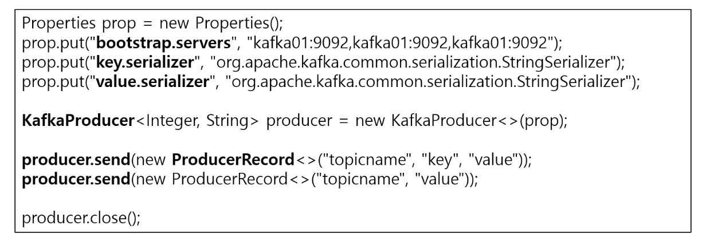
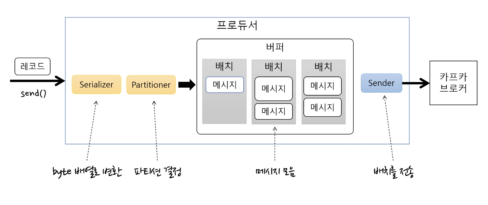
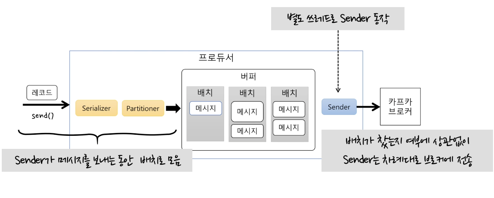
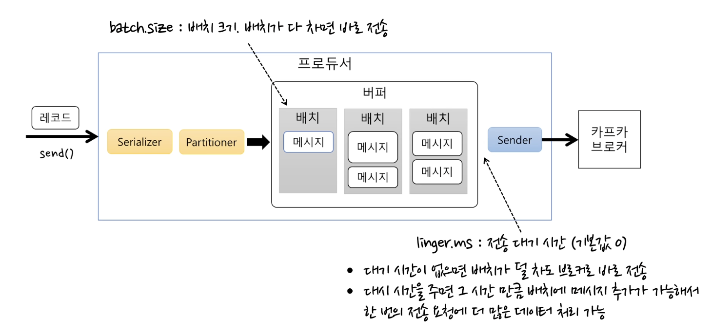
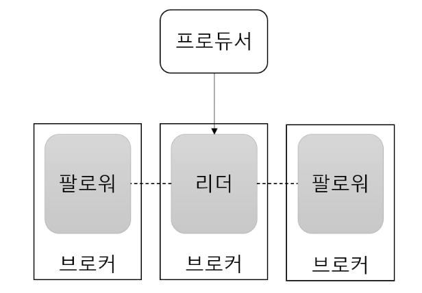
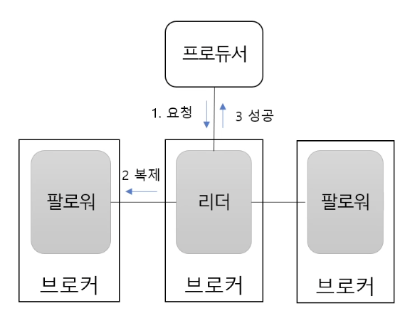
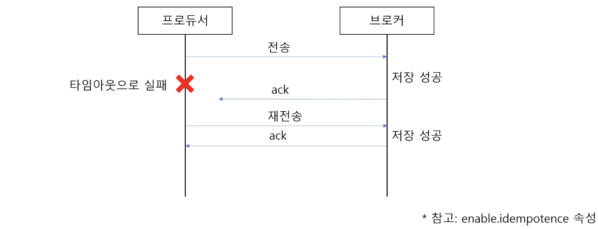
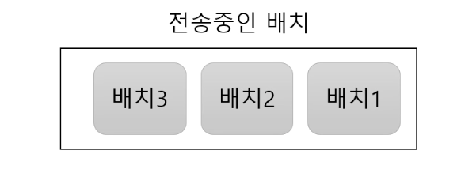

### ✅ 프로듀서

토픽에 메시지 전송




- Properties를 이용해 프로듀서가 사용할 속성 지정(설정 정보)

  → 브로커 목록이나, 키와 밸류를 직렬화할 때 사용할 serializer, 그 외 ack, 배치 사이즈 지정 가능

- KafkaProducer 생성 객체를 만듬
- KafkaProducer 객체의 send 메서드 → ProducerRecord 전달
- ProducerRecord → 카프카 브로커에 전송할 메시지가 됨, 아래 두 가지 방법으로 생성 가능
    - 토픽, 키, 값 or 토픽, 값
- 프로듀서를 다사용했다면 close() 메소드를 이용해 닫아줌

### ✅ 프로듀서의 기본 흐름




1. send() → 프로듀서 메시지 전송
2. Serializer → byte 배열로 변환
3. Partitioner → 메시지를 어느 토픽의 파티션으로 보낼지 결정
4. 변환된 byte 배열을 배치로 묶어서 버퍼에 저장
5. Sender → 배치를 차례대로 가져와서 카프카 브로커로 전송

### ✅ Sender의 기본 동작




- 별도 스레드로 Sender 동작
- Sender는 배치를 차례대로 꺼내서 브로커로 보내는데, 배치가 찼는지 여부에 상관없이 전송함
- Sender가 배치를 브로커에 보내는 동안 send() 메서드를 통해 들어온 메시지는 계속 버퍼 배치에 누적해서 쌓이게 됨
- Sender는 배치가 다 차지 않아도 보냄 → 배치에 메시지가 한 개이던 여러개던 메시지를 보낼 수만 있다면 보낸다는 뜻
- 따라서 Sender와 관련된 속성이 처리량에 영향을 주게됨

### ✅ 처리량 관련 주요 속성



- batch.size: 배치 크기, 배치가 다 차면 바로 전송
    - 배치 크기가 작으면 전송횟수 증가 → 처리량이 떨어짐
- linger.ms: 전송 대시 시간 (기본값 O)
    - 대기 시간이 없으면 배치를 바로 전송
    - 대기 시간을 주면 그 시간 만큼 기다렸다 배치를 전송

  → 대기 시간을 주면 그 시간 만큼 배치가 쌓이게 되고, 한 번에 더 많은 메시지를 보낼 수 있는 여지가 생김

  → 전반적인 처리량이 높아지는 효과


### ✅ 전송 결과 확인

**확인안함 - send() 메서드로 메시지 전송 이후 특별히 아무것도 하지 않으면**

```java
prodcer.send(new ProducerRecord<>("simple", "value"));
```

- 전송 실패를 알 수 없음
- 실패에 대한 별도 처리가 필요없는 메시지 전송에 사용

**확인함 - 1. Future 사용**

```java
Future<RecordMetadata> f = producer.send(new ProducerRecord<>("topic","value"));
try{
	RecordMetadata meta = f.get(); // 블로킹
} catch(ExcutionException ex){
}
```

- send() 메서드가 리턴하는 Future
- Future의 get 메서드를 이용해서 성공 결과를 알 수 있음

  → 그 즉시 블로킹이 됨, 즉 하나 보내고 블로킹 하나 보내고 블로킹

  → 배치에 메시지가 쌓이지 않음 하나씩 들어가게 되는 것

- 배치 효과 떨어짐 → 처리량 저하
- 처리량이 낮아도 되는 경우에만 사용

**확인함 - 2. Callback 사용**

```java
producer.send(new ProducerRecord<>("topic","value"),
	new Callback(){
		@Overrive
		public void onCompletion(RecordMetadata metadata, Exception ex){
		}
	});
```

- send() 메서드에 콜백 객체 전달
- 전송 완료되면 그 결과를  onComplietion 함수로 받게됨
    - 이때 Exception 객체를 받게되면 실패 한 것
    - 성공 실패에 따른 처리 가능
- 처리량 저하 없음

### ✅ 전송 보장과 ack



**ack = 0**

- 서버 응답을 기다리지 않음
- 전송 보장도 zero

**ack = 1**

- 파티션의 리더에 저장되면 응답 받음
- 리더 장애시 메시지 유실 가능 → 팔로워에는 복사가 안된 시점이라면

**ack = all (또는 -1)**

- 모든 리플리카에 저장되면 응답 받음
    - 브로커 min.insync.replicas 설정에 따라 달라짐

### ✅ ack + min.insync.replicas

**min.insync.replicas (브로커 옵션)**

- 프로듀서 ack 옵션이 all일 때 저장에 성공했다고 응답할 수 있는 동기화된 리플리카 최소 개수



예1) 리플리카 개수 3, ack = all, min.insync.replicas = 2

- 리더에 저장하고 팔로워 중 한 개에 저장하면 성공 응답 → 최소 개수 충족

예2) 리플리카 개수 3, ack = all, min.insync.replicas = 1

- 리더에 저장되면 성공 응답
- ack = 1 과 동일 → 리더 장애시 메시지 유실 가능

예3) 리플리카 개수 3, ack = all, min.insync.replicas = 3

- 리더와 팔로워 2개에 저장되면 성공응답
- 팔로워 중 한 개라도 장애 → 리플리카 부족으로 저장 실패

**→ min.insync.replicas 옵션은 리플리카 개수와 동일하게 지정하면 안됨**

### ✅ 에러 유형

**전송 과정에서 실패**

- 전송 타임 아웃(일시적인 네트워크 오류 등)
- 리더 다운에 의한 새 리더 선출 진행 중
- 브로커 설정 메시지 크기 한도 초과
- 등등

**전송 전에 실패**

- 직렬화 실패, 프로듀서 자체 요청 크기 제한 초과
- 프로듀서 버퍼가 차서 기다린 시간이 최대 대기 시간 초과
- 등등

### ✅ 실패 대응 1 : 재시도

**재시도**

- 재시도 가능한 에러는 재시도 처리
- 예) 브로커 응답 타임 아웃, 일시적인 리더 없음 등

**재시도 위치**

- 프로듀서는 자체적으로 브로커 전송 과정에서 에러가 발생하면
- 재시도 가능한 에러에 대해 재전송 시도 → retries 속성
- send() 메서드에서 익셉션 발생시 익셉션 타입에 따라 send() 재호출
- 콜백 메서드에서 익셉션 받으면 타입에 따라 send() 재호출

**아주 아주 특별한 이유 없다면 무한 재시도 X**

- 다음 보내야할 메시지 밀리니까 주의해야함

### ✅ 실패 대응 2 : 기록

**추후 처리 위해 기록**

- 별도 파일, DB 등을 이용해 실패한 메시지 기록
- 추후에 수동(또는 자동) 보정 작업 진행

**기록 위치**

- send() 메서드에서 익셉션 발생시
- send() 메서드에 전달한 콜백에서 익셉션 받는 경우
- send() 메서드가 리턴한 Future의 get() 메서드에서 익셉션 발생시

### ✅ 재시도와 메시지 중복 전송 가능성



- 브로커 응답이 늦게 와서 재시도할 경우 중복 발송 가능
- 성공 응답 ack가 늦게와서 타임아웃 나서 재전송 해버리면..
- enable.idempotence 속성 → 중복 전송 가능성 줄일 수 있다고 함

### ✅ 재시도와 순서

**max.in.flight.request.per.connection**

- 재시도는 전송 순서를 바꾸기도함
- 블로킹 없이 한 커넥션에서 전송할 수 있는 최대 전송중인 요청 개수
- 이 값이 1보다 크면 재시도 시점에 따라 메시지 순서가 바뀔 수 있음
- 전송 순서가 중요하면 이 값을 1로 지정


- 예를 들어 전송중인 배치가 3개
    - 배치 1 전송 → 실패
    - 배치 2 전송 → 성공
    - 배치 3 전송 → 성공
    - 배치 1 전송 재시도 → 성공

  →순서 2, 3, 1


### ✅ 정리

- 프로듀서의 전반적인 흐름
- 처리량 관련
    - batch.size
    - linger.ms
- 전송 신뢰성
    - ack = all
    - min.insync.replicas = 2
    - replication factor = 3
- 재시도 주의 사항
    - 중복 전송
    - 순서 바뀜

### ✅ 궁금한 점

- 프로듀서를 다사용했다면 close() 메소드를 이용해 닫아줘야한다는데 안닫아주면 어떻게 되는지? 커넥션 안닫으면 커넥션 풀 문제 생기는 것처럼 문제 발생하는지 궁금함
- Sender는 배치가 다 차지 않아도 보낸다했는데? 그 다음에 batch.size를 설명했음 이때는 배치가 다 차면 바로 전송이라는데, 이게 조금 헷갈림
    - batch.size 10 → 1개만 차도 뭔가 차례가 오면 보냄, 차례가 아니어도 10개 차면 바로 보냄?
- send() 메서드로 메시지 전송 이후 특별히 아무것도 하지 않으면 전송 성공/실패에 대해 확인 불가해서 실패에 대한 별도 처리가 필요없는 메시지 전송에 사용한다고 했는데 이런 케이스가 뭐가 있을지 감이 잘 안와서 예시같은게 있을지?

[🔗 출처 링크](https://www.youtube.com/watch?v=geMtm17ofPY)