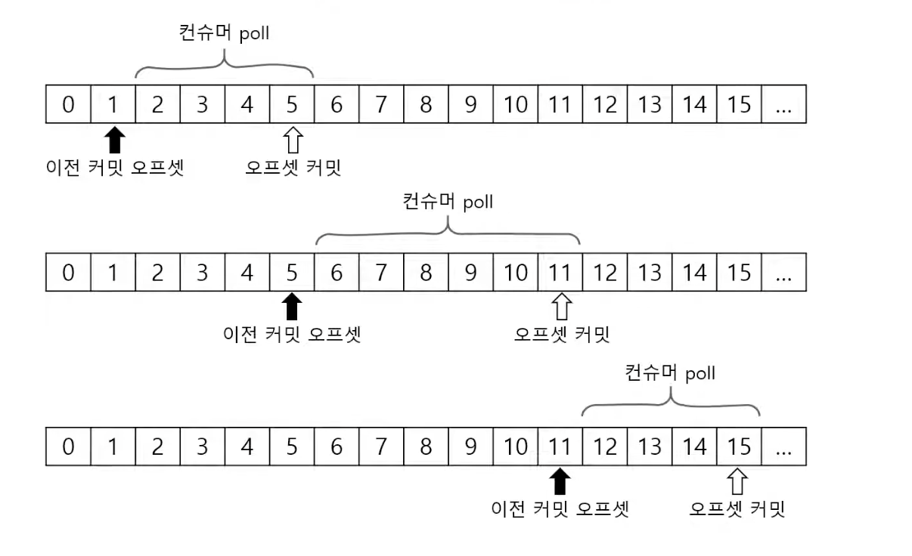

### ✅ 컨슈머

토픽 파티션에서 레코드 조회

- 서버 지정
- 그룹 ID 지정
- 메시지 읽어와서 역직렬화 설정
- 역직렬화 설정을 이용해 KafkaConsumer 객체 생성
- KafkaConsumer 객체의 subscribe 메서드 호출 → 호출 시 내가 구독할 토픽 목록을 전달
- 특정 조건을 충족하는 동안 루프를 돌면서,
- poll 메서드 호출 → 일정 시간동안 대기하다가 브로커로 부터 ConsumerRecord 목록을 읽어옴
- 읽어온 ConsumerRecord를 다시 루프를 돌면서 필요한 처리를 함
- 다 사용한 다음에는 마지막으로 close() 메서드를 이용해 종료 처리

### ✅ 토픽 파티션은 그룹 단위 할당

컨슈머 그룹 단위로 파티션 할당

- 컨슈머 개수와 파티션 개수는 밀접하게 관련되어 있음
- 컨슈머 개수 > 파티션 개수 → 컨슈머가 놀게 됨
- 즉 컨슈머 개수는 파티션 개수보다 많아지면 안됨!
- 만약 처리량이 떨어져서 컨슈머를 늘려야한다면, 파티션 개수도 함께 늘려야함

### ✅ 커밋과 오프셋

- 컨슈머의 poll 메서드는 이전에 커밋한 오프셋이 있으면 그 오프셋 이후의 레코드를 읽어옴
- 읽어온 후 마지막 읽어온 레코드의 오프셋을 커밋함
- 다음 poll 메서드를 실행하면, 다시 앞서 커밋한 오프셋 이후로 레코드를 읽어오고 반복

### ✅ 커밋된 오프셋이 없는 경우

처음 접근이거나 커밋한 오프셋이 없는 경우

- auto.offset.reset 설정 사용
    - earliest : 맨 처음 오프셋 사용
    - latest: 가장 마지막 오프셋 사용 (기본값)
    - none : 컨슈머 그룹에 대한 이전 커밋이 없으면 익셉션 발생
- 사진 오른쪽 latest인데 오타남

### ✅ 컨슈머 설정

조회에 영향을 주는 주요 설정

- fetch.min.bytes : 조회 시 브로커가 전송할 최소 데이터 크기
    - 기본값 1
    - 이 값이 크면 대기 시간은 늘지만 처리량이 증가
- fetch.max.wait.ms: 데이터가 최소 크기가 될 때까지 기다릴 시간
    - 기본값 500
    - 데이터가 최소 크기가 되지 않는다고 무한정 기다릴 수 없으니 지정
    - 브로커가 리턴할 때까지 대기하는 시간으로 poll() 메서드의 대기 시간과 다름 → 브로커가 최소 데이터를 모으기까지 대기하는 시간?
- max.partition.fetch.bytes: 파티션 당 서버가 리턴할 수 있는 최대 크기
    - 기본값 1048576 (1MB)
    - 해당 값을 넘어가면 바로 리턴

### ✅ 자동 커밋 / 수동 커밋

- enable.auto.commit 설정 → 자동, 수동 뭐로 할지 설정
    - true: 일정 주기로 컨슈머가 읽은 오프셋을 커밋 (기본값)
    - false: 수동으로 커밋 실행
- auto.commit.inteval.ms : 자동 커밋 주기
    - 기본값 : 5000(5초)
- poll(), close() 메서드 호출 시 자동 커밋 실행

### ✅ 수동 커밋 : 동기 / 비동기 커밋

- commitSync()
    - 커밋 성공시에는 OK, 실패 시 에러 발생
- commitAsync()
    - 비동기 커밋 → 코드 자체에서 바로 실패 알 수 없음
    - 콜백을 받아서 성공,실패 여부 확인 및 처리 가능

### ✅ 재처리와 순서

**동일 메시지 조회 가능성**

- 일시적 커밋 실패, 리밸런스(새로운 컨슈머 추가 혹은 빠져서) 등에 의해 발생

**컨슈머는 멱등성을 고려해야함**

- 예) 아래 메시지를 재처리할 경우
- 조회수 1 증가 → 좋아요 1 증가 → 조회수 1 중가
- 동일한 순서대로 메시지가 다시 조회될 수 도 있는 것 → 단순 처리하면 조회수는 2가 아닌 4가 될 수 있음

**데이터 특성에 따라 타임스탬프, 일련 번호 등을 활용**

- 데이터가 중복되어도 문제가 없도록 고려해야함

### ✅ 세션 타임아웃, 하트비트 최대 poll 간격

> 카프카는 컨슈머 그룹을 알맞게 유지하기 위해 몇가지 설정을 사용함
>

**컨슈머는 하트비트를 전송해서 연결 유지**

- 브로커는 일정 시간 컨슈머로부터 하트비트가 없으면 컨슈머를 그룹에서 빼고 리밸런스 진행
- 관련 설정
    - session.timeout.ms : 세션 타임 아웃 시간 (기본값 10초)

      → 지정한 시간동안 하트비트 없으면 컨슈머 없다고 생각하고 그룹에서 뺌

    - heartbeat.interval.ms : 하트비트 전송 주기 (기본값 3초)
        - session.timeout.ms의 1/3 이하 추천

**max.poll.interval.ms : poll() 메서드의 최대 호출 간격**

- 이 시간이 지나도록 poll()하지 않으면 컨슈머를 그룹에서 빼고 리밸런스 진행

### ✅ 종료 처리

- 보통 무한루프를 돌면서 poll() 메서드로 레코드를 읽어오는 코드를 작성

  → 루프 어떻게 벗어나느냐? wakeup() 메서드

- 다른 스레드에서 wakeup() 메서드 호출
    - poll() 메서드가 WakeupException 발생 → close() 메서드로 종료 처리

### **✅ 주의: 쓰레드 안전하지 않음**

- KafkaConsumer는 스레드에 안전하지 않음
    - 여러 스레드에서 동시에 사용하지 말 것!
    - wakeup() 메서드는 예외 → 나머지 메서드는 여러 스레드에서 호출하면 안됨!!

[🔗 출처 링크](https://www.youtube.com/watch?v=xqrIDHbGjOY)
