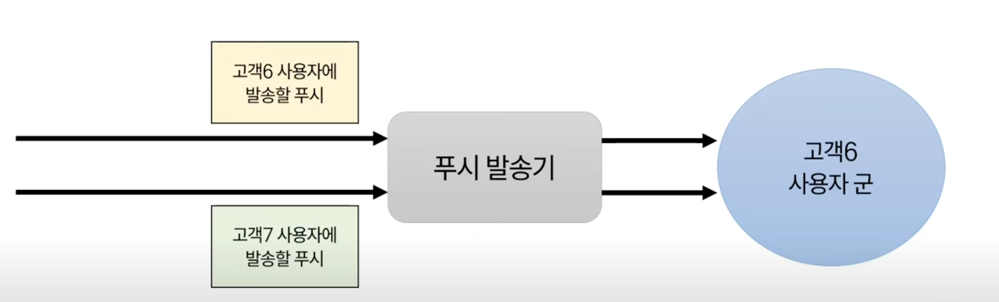

### ✅ 상황

**고객 시스템마다 처리 가능한 트래픽이 다른 상황**

- 우리 시스템이 있고 그 뒤에 각 고객들의 시스템이 위치하는 구조
- 사용자의 요청은 우리 시스템으로 들어오고, 우리 시스템이 알맞은 고객의 시스템과 연동을 해서 사용자한테 필요한 정보를 제공
- 문제는 고객 시스템마다 처리 가능한 트래픽이 다르다는 점! -> 말 그대로 고객사의 서버이기 떄문에 인스턴스 사양 등으로 인해 제각각일 수 있음
- 특정 고객 서비스가 처리량이 낮거나 부하가 일시적으로 증가하면 우리 시스템의 푸시 큐에 처리되지 못한 데이터가 쌓이기 시작하면서 장애로 발전할 수 있고, 
- 또한 고객 시스템에서 응답 지연, 타임아웃 등이 발생해서 연쇄적으로 우리 시스템에 문제를 줄 수 있다.

### ✅ 최초: 동일한 속도로 푸시 발송

- 최초에는 고객에 상관없이 동일한 속도로 사용자에게 푸시 발송
- 따라서 사용자들도, 각각의 사용자군별로 동일한 양의 트래픽으로 우리 시스템에 요청이 들어옴
- 우리 시스템 → 고객사 시스템으로 동일한 트래픽을 전달

**결과 - 고객 시스템마다 상이한 트래픽 처리량으로 인해 장애 발생**

- 어떤 시스템은 잘 받아주고, 또 어떤 시스템은 약간 버벅거리고, 또 어떤 시스템은 타임아웃 등의 증상이 발생
- 심한 경우에는 특정 고객 시스템 자체에 장애가 발생해버리는 상황이 발생

-> 예를 들어 A 고객사가 초당 10건을 처리할 수 있는데 우리가 전체 고객사에 초당 100건을 보내면 장애 발생!

### ✅ 개선 1 : 고객 군 마다 다른 속도로 푸시 발송하기

- 고객 시스템들을 **몇개의 군들로 묶어서**, 기본/중간/느리게 속도 단위로 **병렬 발송**하는 형태로 개선 -> 이 군들이란 고객사의 서버 처리량에 따라 묶을 수 있음
- 고객 시스템에 주는 영향을 최소화하는 방향 + 서비스 잘 동작하며 타임아웃 최소화 및 고객 시스템도 보호할 수 있는 방향 선택
- 즉, A 고객사가 초당 10건을 처리할 수 있는데 우리가 전체 고객사에 초당 100건을 보내면 장애로 이어지지만 
- A 고객사를 10건으로 변경하면 100건을 처리할 수 있는 B 고객사는 기존 속도를 유지하고, 더 많은 처리량을 달성할 수 있다.

→ 이렇게 해서 문제를 줄이기는 했는데, 단점 발생!

### ✅ 죽이지는 않으나

- 느리게 발송하는 고객군에 대해서 ‘우리 전용 푸시’와 ‘고객 전용 푸시’ 발송 시기가 겹치면 둘 중에 하나가 오랜시간 대기해야하는 문제 발생
- 예를 들어
    1. 느린군 고객6 시스템
    2. 고객6 사용자군에게 우리 시스템에서 자체 푸시 발송(ex. 이벤트 참여, 정보 사용 내용 공지 등)
    3. 고객 입장에서 이번 달에 ‘이러이러한 요금이 나왔어요’라며 고객 푸시 발송
    4. 두 개의 발송 시기가 겹치면 둘 중 하나는 한참 뒤에 발송됨

       → 푸시를 굉장히 느린 속도로 발생을 했으니

### ✅ 개선 2 : 우리 푸시와 고객 푸시 분리 발송

- 우리 푸시와 고객 푸시를 분리하여 우리 푸시때문에 고객 푸시가 늦게 발송되는 문제 해소
- 둘을 별도의 스레드로 발송처리하게 변경

→ 우리 푸시가 나가는 동안에 고객 푸시 발송 요청이 들어오더라도 고객 푸시 바로 나갈 수 있게 개선

→ 그럼에도 또 다른 문제는 남아있었음

### ✅ 우리 푸시가 고객 푸시를 방해하지는 않지만

- 느리게 발송하는 고객군 6, 7
- 타이밍상 절묘하게 고객 푸시가 겹쳐서 발송되는 시점이 존재
- 먼저 발송되는 애(느린…)가 있으면 그 뒤에있는 푸시는 많이 늦어지는 문제

### ✅ 개선 3: 같은 속도 병렬 발송

- 같은 속도에 속한 고객 사용자 군별로 병렬 푸시
- 고객 6의 사용자를 병렬로 발송처리하면 안되니까 → 트래픽이 늘어나는 것
- 고객 6 사용자용 푸시와 고객 7 사용자용 푸시를 별도로 나뉘어서 발송하도록 처리

→ 같은 속도에 속한 고객 푸시라도 한 푸시 때문에 다른 푸시가 뒤에 줄서서 늦게 발송되는 문제 해소

### ✅ 남은 과제, 우리 푸시도 느리게 발송

- 고객의 시스템을 보호하면서도 푸시를 가능하면 너무 느리지 않게 발송하기 위해서 점진적으로 속도를 나누고 병렬로 처리하는 과정들을 거쳐왔는데, 고객 시스템과 관계없는 우리 시스템의 푸시는 빠르게 못보내고 있다.
- 전체 사용자에 대해서 어떤 사용자가 속해있는 고객 시스템에 따라서 푸시 속도를 다르게 보내고 있기 때문이다.

Why?
- 우리 시스템에 사용자가 접속을 하면, 사용자가 가장 먼저하는 일이 고객 시스템과 통신하는 것 
- 사용자에게 필요한 정보가 고객 시스템쪽에 있기 때문에 무조건 1회 통신을 해야하는 상황 
- 이 통신때문에 부득이하게 고객 시스템에 사용자가 몰리지 않게 하기 위해서 우리 푸시더라도 어쩔수 없이 일부는 나눠서 보내고 있다. 
- (이것을 어떻게 할 것인가가 다음의 고민임, 이후 영상으로 해결 내용 공유하는 시간 오길 기대)

### ✅ 궁금한 점 및 정리
Q. 고객사 서버의 처리 능력에 고객군들을 나누어서 발송 속도를 다르게 보내도록 할 때 이 고객사 서버의 처리 능력은 어떻게 측정할 수 있었을까?
기존 데이터 로그 등 데이터 기반 or 고객사 서버 인스턴스 정보가 있어거 그걸 바탕으로 임의로 고객군을 나누었다 -> 이런 느낌일지?

A. 보통 단건요청은 RTT(요청 왕복 시간)를 특정하면 되는데 부하테스트 등의 TPS를 측정해주는 게 좋다. 시간대별로 트래픽이 다른것도 있고, 부하걸리면 서버가 어떻게 될지 모르기 때문에.
   그리고 해당 측정 값을 기반으로 어떤 고객 서버는 이 큐를 타고, 어떤 고객 서버는 저 큐를 타고 등 처리를 할 수 있다.

💡 정리하자면 
- 부하나 트래픽 등 종합해서 TPS 지표 측정 후 해당 값 결과 기준으로 성능 좋은 값을 가진 얘는 기본 속도의 큐를 타고, 중간 정도면 중간 속도의 큐, 별로인애는 느린 속도의 큐에서 동작하도록 한다.
- 거기에 해당 큐 별로 각 고객 서비스 별로 병렬로 푸시 알림 가도록 로직을 처리할 수 있다.
- 따라서 성능 기준으로 같은 관심사끼리 로직을 분리했다고 볼 수 있다.
- 하지만 측정 자체가 힘들고 시간대별로 다를 수 있기 때문에 동적알고리즘을 가져가며 측정에 따라 동적으로 그때 그때 유연하게 큐 옮겨다닐 수 있는 구조로 가는게 좋다.

[🔗 출처 링크](https://www.youtube.com/watch?v=vC9wyaFug6A)