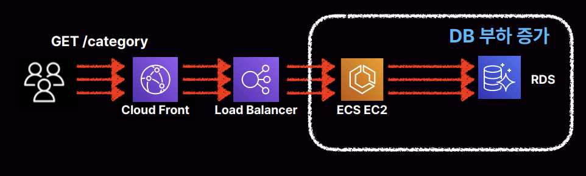
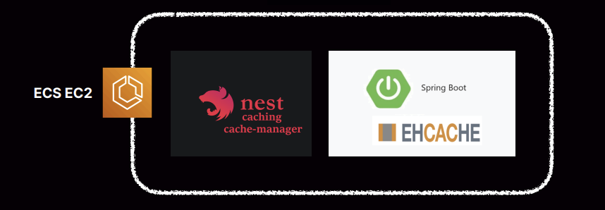

### ✅ 2023년 인프런 아키텍처 리뷰

**목적 조직마다 레거시 시스템 복제 + 각 신규 시스템과 함께 점진적 개선 목표**

- 각 목적 조직의 기능개선 및 지표달성과 함께 레거시 시스템 개선을 위함
- 그 결과, 기술 스택 전환 진행이 이루어진 조직과 그렇지 않은 조직으로 나눠짐

**왜?**

- 글로벌 진출, 20여명의 개발조직 → 프로덕트 조직 전체가 합심하여 인프런의 국제화 진행
- 학습외 서비스들은 국제화에서 후순위 밀림
- 인프런 학습 서비스들만 국제화에 용이하도록 먼저 신규 기술 스택 전환
- 각 조직의 예정된 프로젝트 Drop

### ✅ 트래픽 비용 개선 - 이미지 포맷

- 글로벌 가기 전 기반 작업
- 치솟는 환율, 글로벌 무상 트래픽(다른 나라 무료 강의 트래픽 발생시켜야함)
- 오픈 전 비효율적인 트래픽 비용을 개선 목표

**이미지 포맷 as is**

- 화면에 필요한 만큼의 이미지 크기만 전송
- 요청에 맞게 리사이징 및 캐시로 이미지 트래픽 최적화

**But, 이미지 포맷에 따라서 파일 크기의 차이가 너무 컸음**

- png, jpeg의 높은 파일 크기
- 50kb X 60개 = 1 페이지에 약 3mb
- 트래픽이 많아지면 많아질수록 이것에 대한 비용 지불, 하지만 결제까지 이루어지지 않으면 회수 불가하므로 최적화 해야겠다고 생각

**고품질, 저용량의 avif 파일 확장자**

- 품질 저하 없는 고효율 압축 JPEG에 비해 최대 50%까지 용량 개선
- 대부분의 브라우저에서 지원

**이미지 포맷 to be**

- 요청에 맞게 avif 변환, 리사이징, 캐시로 이미지 트래픽 최적화

**결과**

| png | 51.57 KB  | 0 % |
| --- | --- | --- |
| webp | 42.97 KB | - 16.6 % |
| avif | 19.23 KB | - 62.71 % |
- 파일 확장자 변경으로 전체 이미지 트래픽의 60% 감

### ✅ 트래픽 비용 개선 - JSON CDN Cache

**수많은 DB 조회 요청**

- 인프런 강의 탭 눌렀을 때 나오는 카테고리 정보들
- 모든 페이지에서 호출되는 전체 카테고리
- 매일 수백만번 호출되는 JSON 데이터 1일 150GB

**수많은 DB 조회 요청을 외부 Cache로 개선**

**외부 Cache의 높은 트래픽 발생**

- DB 부하는 줄었지만 결과적으로 ElasticCache라고 하는 미들웨어를 세 대 이상 운영했어야함 → DB 스펙 한단계 높이는 거랑 비슷한 비용

**애플리케이션 계층에서 캐시할 수 있는 로컬 캐시로 전환**

- 어차피 JSON 데이터이니 그냥 직접 캐싱하자고 생각
- nestjs의 캐시매니저, 스프링부트 EHCACHE 등 로컬 캐시로 캐시 계층을 이동

**로컬 캐시로 애플리케이션만으로 트래픽 처리**

- DB 부하는 줄이면서 원격 미들웨어는 추가하지 않고 기존 애플리케이션 서버군 안에서 처리가능할 정도로만 로컬 캐시를 사용 → 목표 달성했다고 생각했는데…

**EC2의 수많은 트래픽 비용은 어떻게 개선하나?**

- EC2 서버가 받는 하루 150GB, 한달 4.5TB 트래픽은 똑같음

**결과적으로**

- 외부 캐시(Elastic Cach) 로컬 캐시 (EhCache) 등으로
  DB, Elastic Cache의 부하는 개선
- But, EC2는 여전히 많은 API 조회 처리 → **많은 동일 API 조회**

**CDN 캐시 해도 되지 않을까?**

- 어차피 관리자가 변경해야하는 데이터고…변경 빈도가 낮음
- API 데이터 == JSON 파일,  JSON 파일 == image, js, css(정적 파일)

**그럼 JSON 데이터를 어디에 보관할까?**

- S3: 카테고리 업데이트 마다(S3 파일 교체 필요, File Write 필요)
- API 응답 캐시: 기존 API 에서 변경 없음, S3 교체 등 추가 구현 없음

**CDN 계층 캐시로 EC2는 요청 최소화**

- EC2에서 내려가는 JSON 데이터를 CloudFront에서 캐싱
- 한 번 내려주면 갱신하기 전까지 CDN에서 바로바로 데이터를 내려줌

**결과**

- 애플리케이션 로드 70% 감소
- 로드밸런서 트래픽 50% 감소
- 일 150GB, 월 4.5TB 트래픽을 EC2로 처리하지 않아도 됨
- 추가로 CDN 트래픽 비용 절감할 수있는 계약 같은 것도 있어서 더 절감했음

**유의사항**

- 애플리케이션 응답 JSON을 캐싱한다는 것은 헤더도 캐싱이 된다는 것 → 쿠키가 포함
- CDN은 cache-control 에 따라 쿠키도 캐시할 수 있다
- 한 사용자가 로그인한 세션 쿠키가 캐싱되어있는 채로 CDN에서 내려간다 → 모든 사용자들의 세션이 그 사용자의 세션으로 교체되어버림
- 따라서 비즈니스 드리븐한 API를 CDN 캐싱할 때는 cache-control 설정을 잘해줘야함
- 백엔드에서 내려준 API들은 전부 쿠키나 cache-control쪽 설정을 변경해서 사용중(디폴트하면 캐싱함!)

### ✅ API 환경 개선

- 비용은 조절 완료, 국제화에 맞게 아키텍처 개선
- 서비스 국제화(+SEO)를 위해 Express → Next.js

**브라우저에서의 모든 요청은 Next.js가 1차로 받도록함**

- 1차적으로 사용자 제공 페이지는 Next가 처리, SSR로 내려주더라도 부분부분 변경이 필요한 경우 CSR로 API 호출하는데 이를 **Next.js에서 API Proxy**해서 처리하도록 함
- 중간 계층을 모두 Next가 담당을 하도록 함

**Next.js Rewrite 옵션을 사용함**

- Next.js를 단순히 렌더링 서버로만 쓰지 않고 API Proxy 서버로도 사용 가능하며 관리에 용이 → 어떤 관리가 편한걸까?

**SSR은 Next.js가 직접, API 호출은 Next.js 가 Proxy해서 간편하게 처리**

- Next.js -> 백엔드 API 이 구조만 있으면 좋을텐데 분산환경임
- 즉, 이 백엔드 API도 호출해도 다른 백엔드도 호출할 수 있음

**다른 백엔드도 API 호출 필요**

- 결국 Nest.js가 호출하는 API는 외부 제공 용도 → 당연히 세션 체크함(뒷단에서 백엔드 서버가 하기로함)
- 내부 백엔드 서버들끼리는 세션 체크를 거의 하지 않음 → 세션 쿠키를 모든 백엔드 서버가 들고 있을 수 없으니 + 어차피 비공개망에서 움직이니 특정 인증키만 가지고 체크를 하고 세션 체크까지는 X
- 어차피 내부, 외부 API 로드밸런서 두 개를 만들어서 하나의 서브넷에 붙여놓으면 결국 그쪽 도메인을 통해서 호출했을 때 공개망인지 비공개망인지 구분할 수 있게됨

**내부의 가장 중요한 API들이 외부에서 호출할 수 있게 됨**

- 서버 한 대 → rewrite 옵션을 통해서 모든 요청을 Next.js가 다 처리 가능
- interna-api에서 사용하라고 만들어 놓은 api 경로를 일반 사용자가 크롤링, 봇들, 스팸들 돌려보면서 호출 가능
- 근데 Next.js는 무조건 바이패스 해버려서 그 API를 호출할 수 있게 되는 것 → 세션 체크 안하는 API를..

**해결방법**

- 외부용, 내부용 프로젝트 코드를 분리한다. → 모든 백엔드 인프라가 2배

- 내, 외부 모두 세션 체크를 한다 → 분산된 환경이 커질수록
  모든 API가 세션 쿠키를 가지는 것은 인프라 부하, 코드 복잡도 가중

**프로젝트도 분리하지 않고 세션 체크도 추가하지 않는 가장 쉬운 방법 → API Path를 1단계 추가**

- 프론트엔드가 호출하는 모든 API에는 /client를 붙인다

**Rewrite 에도 /client 부터**

**Next.js Proxy 호출시에도 내부망을 사용할 수 있게 됨**

- 내부 API지만 세션 체크가 필요하면 /client 붙임
- 물론 EKS나 쿠버네티스 환경이었으면 좀 더 쉽게할 수 있었겠지만 당장 전환은 어려워 라우트 규칙을 사용

**Route 분기 처리 개선**

- 너무 많은 분기 조건

**쿠키, Header 에 따라 정규표현식 조건 X**

- 쿠키, Header 에 따라 동일한 path 지만 레거시 호출일 때도 있고 신규(Next.js)일 때도 있음
- CloudFront에서 해당 옵션 설정하려니 어려움
- Behavior 제한(기본 25개 최대 250개), 한정된 기능(복잡한 분기 조건 X), 복잡한 설정(쿠키 등 복잡한 조건 X)

**Reverse Proxy(Nginx 등)**

- traefik 사용
- Go 기반, 고차원 조건 가능(header 기반 등), 숫자 제약 없는 Route 구성, 서버 재시작 없는 동적 구성 변경

**쿠키, Header 에 따라 정규표현식 조건 O**

- 코드로 분기 관리 → 버전 관리 가능
- Cloud Front의 한계를 넘어 점진적 Next.js 개편 가능
- 하나의 서비스, 동일한 URL → 둘다 오픈, 일반 사용자는 레거시로 회사내 사람들은 Next.js로 만들어진 서비스로 가게해서 운영 QA까지 끝낼 수 있음, traefik 설정 원복해서 바로 바꿔치기도 가능

### ✅ 앞으로

- 국제화를 위한 사전 작업 기간 이었음
- 이제 국제화 작업 시작 예정 - 25년도 부터 일부기능 다국어 사용 가능 예정
- 국제화에 엮여있는 통화나 등등 어렵지만 팰리컨적 사고로 일단 시도하고 기술적 도전 계속 공유 예정

### ✅ 궁금한 점

**카테고리 API를 JSON 파일로 CDN 캐시했다고 하는데 API 응답 캐시가 어떤 방법인지, 어떻게 구현하는지?**
- 'API 응답 = JSON = 텍스트파일' 결국 다 동일한거라 CDN에서 정적파일처럼 캐싱 가능
- 원래 프론트에서 렌더링할때 /categories 처럼 API 쏘던걸 /static/categories.json 형태로 CDN 구간만 태우고 렌더링
- 예를 들어 서버는 변경점 있을때마다 JSON 만들어서 업데이트 쳐두는 방식으로 구현 가능 -> 카테고리 변경점생기면 CDN 업데이트하고 무효화하도록

**Next.js를 단순히 렌더링 서버로만 쓰지 않고 API Proxy 서버로도 사용 가능하며 관리에 용이하다고 했는데, 어떤 관리가 편한건지, 어떤 이점이 있어서 이렇게 처리하는 건지?**
- API 프록시 = 클라이언트에서 API 호출할 때 Next가 중간에서 대신 호출해준다 ->  백엔드 서버 보호(url 노출 방지)
- 세션이나 쿠키같은걸 Next에서 들고있다가 포함시켜서 백엔드로 줄 수도 있고 -> 쿠키/세션 관리의 일관성
- 내부 프라이빗 경로나 퍼블릭 경로로 분기하는 로직도 Next에서 관리할 수 있음 ->  퍼블릭 / 프라이빗 경로 관리

[🔗 출처 링크](https://www.inflearn.com/conf/infcon-2024/)
