> 우리 회사도 가지고 있는 레거시 문제를 다른 회사, 인프런에서는 어떻게 해결했을까?
>

### ✅ 2022 인프런 아키텍처 리뷰

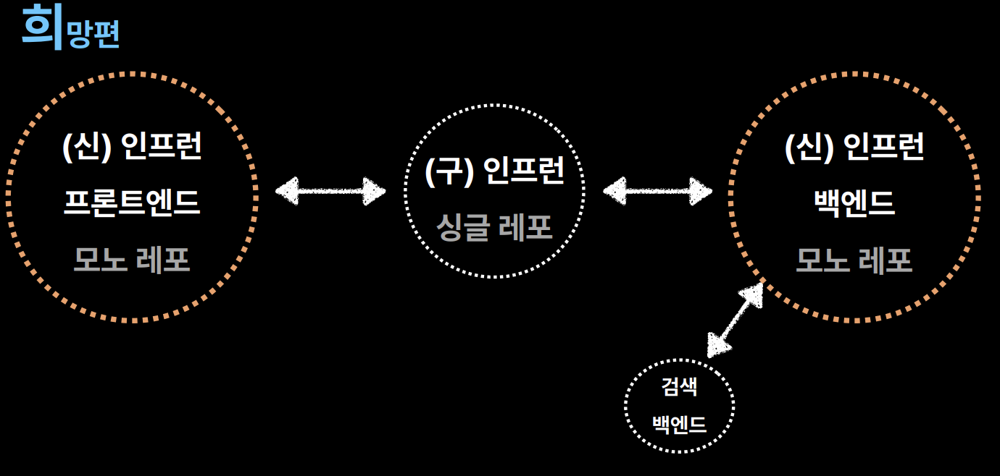

- 작년 인프콘에서 위처럼 옮겨가고 있었고 앞으로의 목표였음

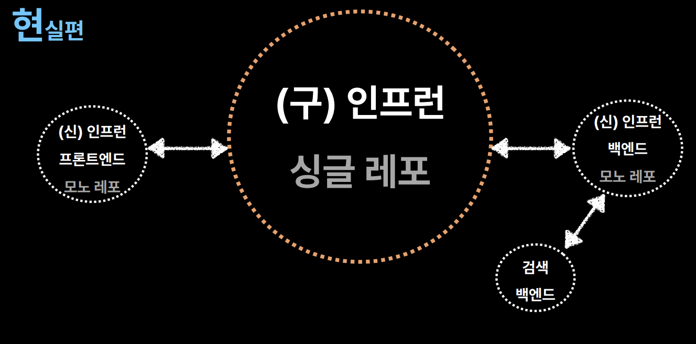

- 1년이 지난 지금, 여전히 같은 모습

**왜? →  22년도 7월, 조직형태의 변화**

- 비즈니스 속도를 유지하고 싶었음
- 규모가 작을 때에는 커뮤니케이션 대상 적고, 기능이나 코드 고쳐야할 양 적어서 빠르게 가능 → 규모 크면 쉽지 않음
- 기존: 기능 단위 조직(PM 팀, 디자인팀, 개발팀) → 조직별 다른 목쵸, 팀대팀 협업 필요 but 어차피 PM 1, 디자인 1, 개발 6 이럴때는 이 자체가 하나의 팀이니 문제 없었음
- 변경: 하나의 목적을 가진 Full Cycle 목적 조직 구성(PM, 디자인, 백, 프) → 담당 제품에 대해서는 Cell 내부에서 즉시 실행

**결과**

- 매월 2~3개 이상의 제품 개선, 출시
- 실행력, 당장의 제품 속도 UP
- 장기적 제품 속도, 조직 안정감 DOWN
    - 내부코드 개선 < **제품 지표 개선**
    - 모든 Cell마다 배정할 수 없는 부족한 시니어 숫자
    - 1명씩 존재하는 직군에서 퇴사자 발생시?

→ 따라서 이 문제를 개선하는 것이 목표

**조직 구조 개선**

- 목적 조직 + 직군 조직(챕터, 파트)
- 셀 + 그 외 정기적으로 같은 직군들끼리 모여서 움직일 수 있는 기능 조직
- 파트별 위키 신설, 정규 미팅으로 장애, 기술 개선 공유
- 모든 PR 파트 공용 채널에 공유

**그럼에도 불구하고**

- 1개의 레거시 프로젝트, N개의 목적 조직 불편한 동거
- 모든 목적 조적이 사용하는 거대한 레거시 시스템
    - 늘어나는 빌드 속도
    - 뒤섞이는 커밋 로그
    - 서로 영향 받는 QA
- 거대한 단일 레거시 시스템의 개편은 어느 조직의 목표인가?

### ✅ 복잡한 문제를 쉽게 해결하기

**MSA?**

→ NO, 소규모 팀이 비즈니스 속도를 낼 수 없음

**Divide and Conquer 분할 정복**

- 거대한 시스템을 **복제**하여 작은 시스템 여러개로 **분할**하자.

**AS-IS**

**TO-BE**

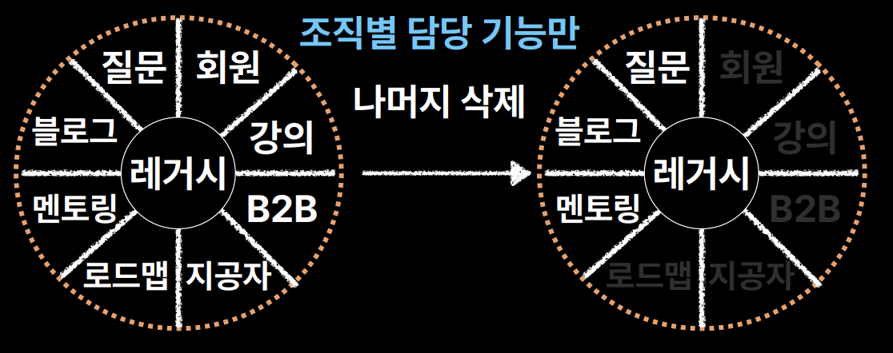

- 조직만큼 5개 복제 → 조직별 담당 기능만 빼고 나머지 코드 다 삭제
- 조직별 레거시 시스템이 만들어지게 됨 → 도메인 쪼개기
- 결국 목적 조직은 작은 레거시 하나, 작은 신규 스택 하나 이런식으로 남게 됨

→ 목적 조직 마다 갖게 된 레거시 인프런 프로젝트

→ 목적 조직 마다 갖게 된 신규 스택 FE, BE 프로젝트

**결과**

- 줄어든 코드만큼 개선된 빌드 속도
- 프로젝트별로 관리되는 커밋 로그
- 독립된 프로젝트에서 격리된 QA

**레거시 개편 == 목적 조직의 목표**

- 미래의 비즈니스 속도 개선을 위한 레거시 개편과 현재의 성과를 위한 비즈니스 구현
- PM, PD, Dev가 함께 검토하기 시작

**프로젝트만 복제하면 되는 것인가?**

### ✅ 구체적 문제와 해결책

**1개의 서비스 → N개의 프로젝트로 분할 → N배로 증설해야할 인프라**

- 인프라 계층 전체의 복제가 필요

**IaC (Infrastructure as Code)**

- 코드를 짜면 AWS 인프라를 자동으로 만들어주는 기술 → AWS CDK, 테라폼, 플루미 등
- 현재의 서비스 인프라를 언제든 쉽게 똑같이 복제할 수 있는 IaC 구성

**Pulumi로 레거시 인프라를 언제든 쉽고, 빠르고, 동일하게
복제 가능한 인프라 환경 구성**

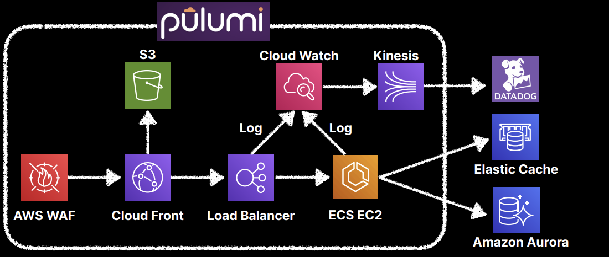

- 선언형 언어가 아니라서 IDE 활용
- 추상화된 설계 가능 가장 훌륭한 문서 품질
- TS ESLint/Prettier, 모노 레포 등으로 높은 품질 관리
- TS Jest를 활용한 단위 테스트

### **1개의 서비스가 N개의 프로젝트로 분할**

**1개의 URL Domain N개의 프로젝트**

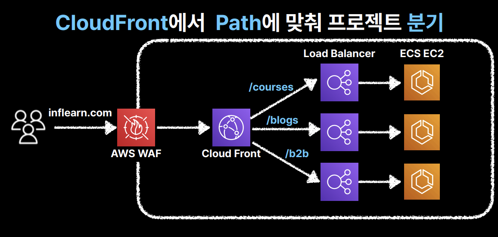

- CloudFront에서 Path에 맞춰 프로젝트 분기
- Load Balancer vs **Cloud Front**
    - path 별로 라우트 분기하는 건 로드밸러서도 할 수 있는 데 왜 CloudFront?
    - Load Balancer가 지원하지 않는 다양한 서비스로 라우팅 가능(S3, API Gateway 등, EC2, Load Balancer, Lambda 포함)
    - 앞단에 CloudFront가 있으니 여러 로드 밸런서 쪽으로 혹은 S3 파일 업로드하거나 다운 링크 쪽에도 하나의 URL로 분기 가능
- 계속해서 URL Path 단위로 변화가 필요하기 때문에 단일 EndPoint를 사용하는 GraphQL을 지금 도입할 수 없음

**내부 API 통신이 많아짐(1)**

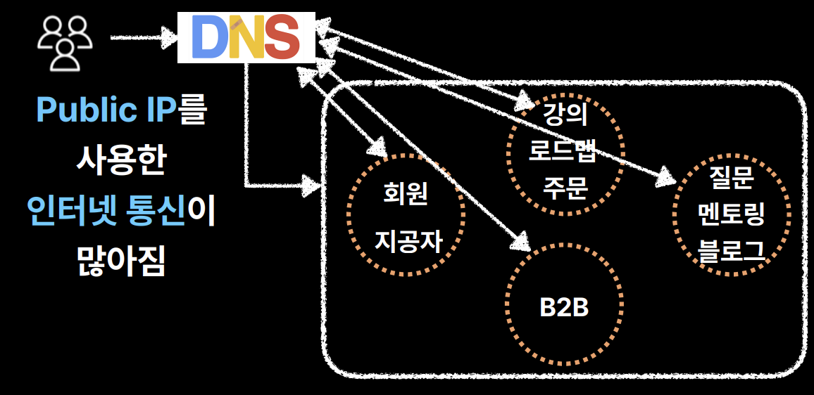

- 외부 DNS 를 거쳐가야 하는 네트워크 리소스
- 외부의 트래픽으로 계산되는 트래픽 비용
- 사내 와이파이, VPN 기반의 내부망 구성의 어려움

→ Public (VPC) Load Balancer + **Private (VPC) Load Balancer**

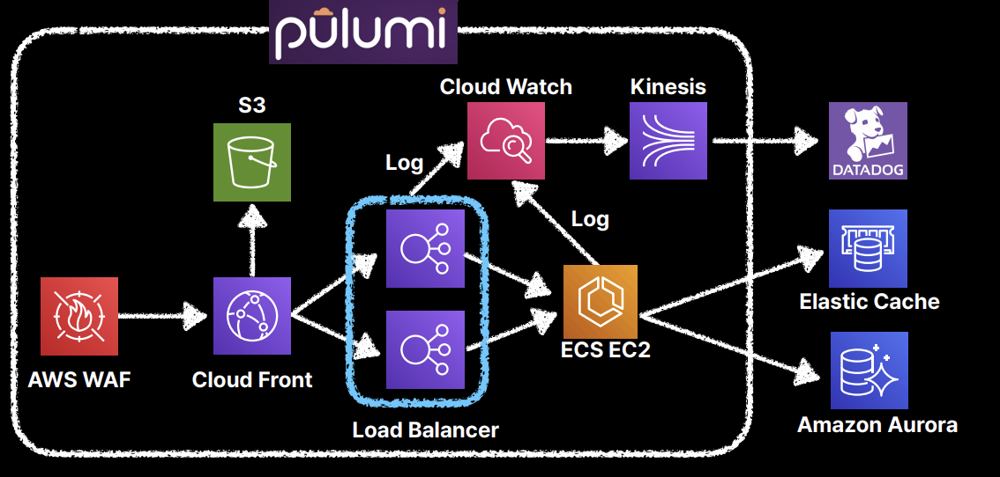

- 외부 DNS 를 거치지 않아 줄어든 네트워크 리소스
- 내부 트래픽으로 트래픽 비용 감소
- 사내 와이파이, VPN 기반의 내부망 구성이 쉬워짐

**내부 API 통신이 많아짐(2)**

- 1개의 사용자 요청 → N개의 내부 API 통신

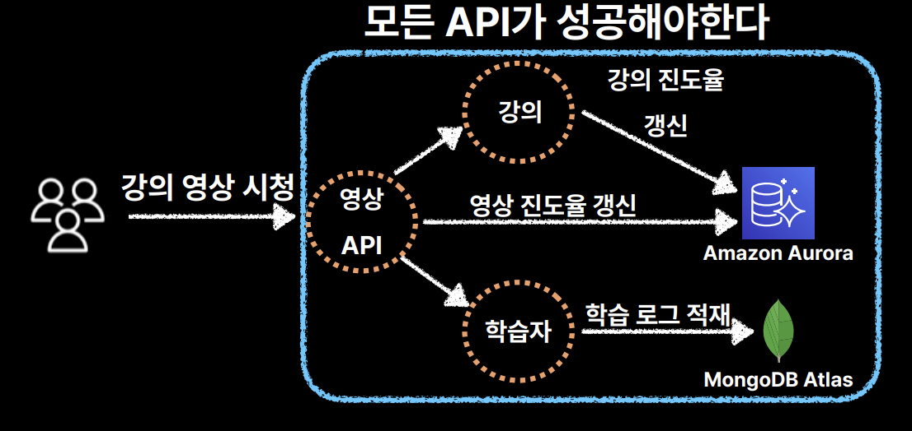

- 다른 프로젝트 로직까지 매번 챙길 수 있을까?
- API 중 하나라도 실패하면 어떻게 할 것인가?
- 모든 API가 성공할때까지 대기시간은 어떻게 할 것인가?

**SNS-SQS 비동기 아키텍처**

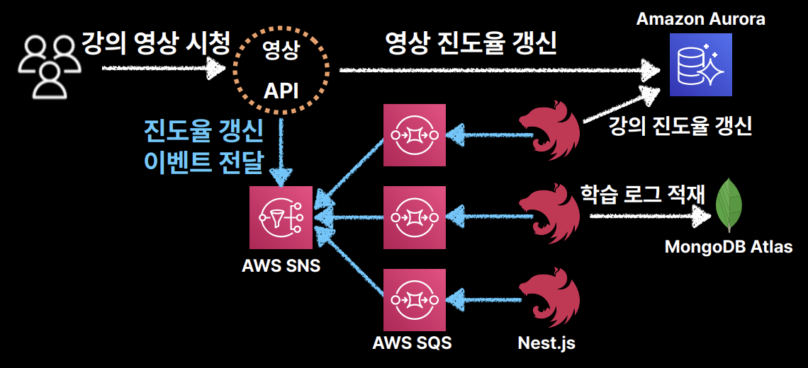

장점

- SNS 이벤트 발행만 하면 되는 도메인 의존성 분리
- SQS를 통해 각각의 프로젝트가 최종적 일관성 보장(시간차는 있어도 리트라이)
- 각 API의 결과를 기다릴 필요가 없음

주의할 점

- 트랜잭션이 필요한 곳에서는 사용하지 않는다
    - 주문이 성공 → 결제가 실패를 하면 안됨
    - 이런 부분들은 그냥 데이터베이스 사용
- 여러 로직이 비동기로 실행되도 무방할때만 적용

보완

- 단일 DB의 장점을 살려 트랜잭션이 중요하면 연관 테이블에 직접 SQL 실행

**단일 DB의 문제점**

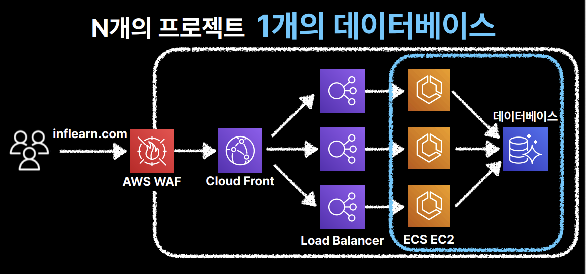

- 테이블 변경 사항에 대한 전체 조직 Sync
- 문제가 되는 SQL 출처 파악
- 중복된 도메인 클래스 관리

**문제점 타파하고자**

- 모든 DDL에 대해 단일 채널 알람
- 프로젝트마다 다른 DB 계정 사용 문제→ 프로젝트 추적 용이
- 거대한 하나의 도메인 클래스 보다는 각 조직마다 최소한의 로직만 있는 중복된 개별 도메인 클래스를 사용한다.

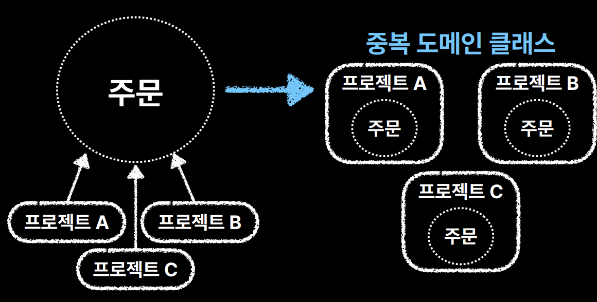

  → 빅브라더 같은 거대한 하나의 도메인 클래스를 모든 프로젝트들이 바라보기 보다 각 프로젝트 조직마다 필요한 로직만 있게 중복해서 사용한다.

**조직의 수가 수십개가 되면? → 앞으로 어떻게 될지 불확실함**

- 불확실한 미래에는 어설픈 추상화/공통화 보다는 삭제하기 쉬운 중복이 낫다
- 도메인에 종속적이지 않은 공통 유틸 클래스, 함수들은 Github Registry로 관리한다.

### ✅ 다음 개선점

- 이메일/문자/ 카카오톡 발송 등 비즈니스에 독립적인 **플랫폼 성격의 API** → DevOps(기능 중심의 조직)
- **인증, 권한을 한 곳에서** 관리할 수 있는 최소 스펙의 API Gateway
- **EndPoint 공유 방지**를 위한 public LB와 private LB에 적합한 형태의 모노레포 구성

### ✅ 마무리

- 트래픽, 장애가 아니라 비즈니스 속도를 위한 조직 개편으로 아키텍처가 개편된 사례
- 소프트웨어 구조는 해당 소프트웨어를 개발한 조직의 커뮤니케이션 구조를 닮게 된다. - 콘웨이의 법칙
- 다음 아키텍처는 → 다음 조직 개선이 있을 때 알 것 같음

[🔗 출처 링크](https://www.inflearn.com/conf/infcon-2023/)
